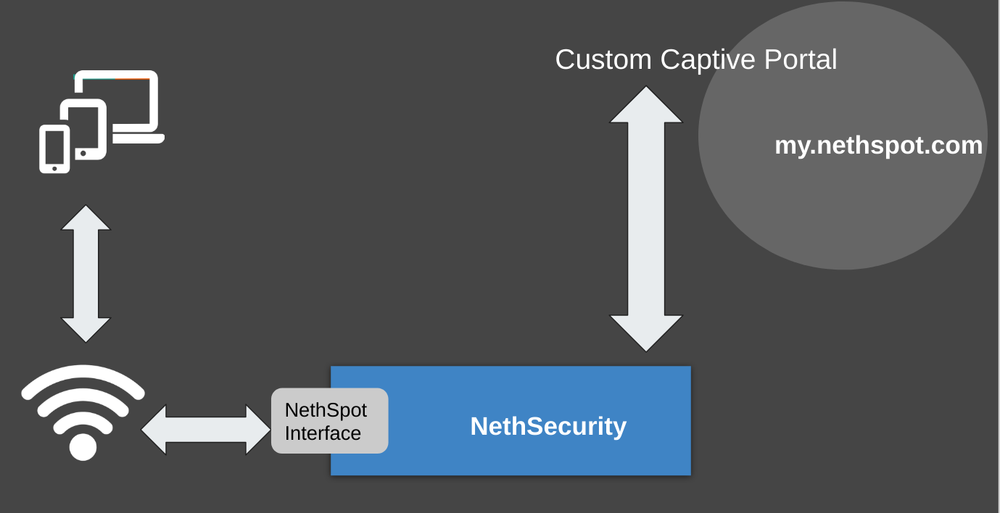

====================
QuickStart |product|
====================

In questo articolo spieghiamo come creare un istanza hotspot e collegare un Nethsecurity ad essa.

Una volta eseguite queste operazioni seguire il documento apposito sulle configurazioni del servizio.

NethSpot è molto semplice da utilizzare, è composto da 2 parti :

* **un client da installare su |parent_product|**
  
  * collegato alla rete AP dialoga con i device

* **il manager |product_url| in cloud**

  * dialoga direttamente con |parent_product|
  * ospita il captive portal cloud
  * permette la gestione totale del servizio

Per usare |product| è necessario che |parent_product| sia configurato con almeno

* un'interfaccia green
* un'interfaccia red
* un'interfaccia che sarà assegnata all'hotspot.

Se non vengono utilizzate VLAN sono quindi necessarie almeno 3 schede di rete.

